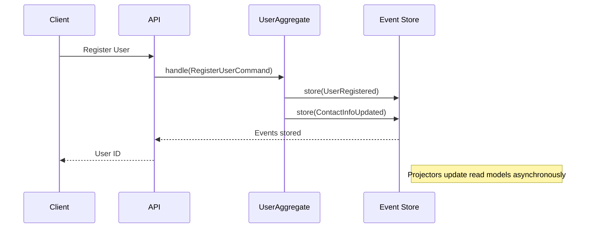

# Advanced Event Sourcing Patterns for Data-Intensive Applications

## Table of Contents
- [Introduction](#introduction)
- [Core Concepts](#core-concepts)
- [Implementation in Multi-Module Applications](#implementation-in-multi-module-applications)
- [Practical Examples](#practical-examples)
- [Performance Considerations](#performance-considerations)
- [Best Practices](#best-practices)
- [Real-world Use Cases](#real-world-use-cases)

## Introduction

Event Sourcing is particularly valuable in data-intensive applications where data integrity, audit trails, and historical tracking are crucial. This document expands on the basic concepts with advanced patterns and practical implementations.

## Core Concepts

### 1. Event Sourcing Fundamentals
- **Events as Source of Truth**: Store all state changes as immutable events
- **Event Store**: Append-only database for events
- **Projections**: Materialized views built from events
- **CQRS**: Separate read and write models

### 2. Advanced Patterns
- **Aggregate Roots**: Transactional boundaries and consistency
- **Sagas/Process Managers**: Complex workflows across aggregates
- **Event Versioning**: Handling schema evolution
- **Snapshots**: Performance optimization for large aggregates

## Implementation in Multi-Module Applications

### User Management


### Record Management System
- Each interaction generates events
- Full audit trail of all changes
- Temporal queries ("show me the record as of last Tuesday")

## Practical Examples

### 1. Resource Management
```php
class ResourceAggregate extends AggregateRoot
{
    private array $items = [];
    private bool $isActive = false;
    
    public function createResource(string $resourceId, array $details): self
    {
        $this->recordThat(new ResourceCreated($resourceId, $details));
        
        return $this;
    }
    
    public function updateDetails(array $details): self
    {
        $this->recordThat(new ResourceDetailsUpdated($details));
        
        return $this;
    }
    
    public function activate(): self
    {
        if ($this->isActive) {
            throw new \DomainException("Resource is already active");
        }
        
        $this->recordThat(new ResourceActivated());
        
        return $this;
    }
    
    public function deactivate(string $reason): self
    {
        if (!$this->isActive) {
            throw new \DomainException("Resource is already inactive");
        }
        
        $this->recordThat(new ResourceDeactivated($reason));
        
        return $this;
    }
    
    protected function applyResourceCreated(ResourceCreated $event): void
    {
        $this->items = $event->details;
    }
    
    protected function applyResourceDetailsUpdated(ResourceDetailsUpdated $event): void
    {
        $this->items = array_merge($this->items, $event->details);
    }
    
    protected function applyResourceActivated(ResourceActivated $event): void
    {
        $this->isActive = true;
    }
    
    protected function applyResourceDeactivated(ResourceDeactivated $event): void
    {
        $this->isActive = false;
    }
}
```

## Performance Considerations

### 1. Snapshots
```php
class SnapshotAggregate extends AggregateRoot
{
    protected int $version = 0;
    
    protected function shouldTakeSnapshot(): bool
    {
        return $this->version % 100 === 0;
    }
    
    protected function takeSnapshot(): void
    {
        Snapshot::create([
            'aggregate_uuid' => $this->uuid(),
            'version' => $this->version,
            'state' => [
                // Current state properties
            ]
        ]);
    }
}
```

### 2. Read Model Optimization
- Use dedicated read models for common queries
- Implement caching strategies
- Consider eventual consistency where appropriate

## Best Practices

### 1. Event Design
- Keep events small and focused
- Use past tense for event names
- Include all necessary context
- Make events immutable

### 2. Testing
```php
class UserRegistrationTest extends TestCase
{
    /** @test */
    public function it_registers_a_new_user()
    {
        $userId = UserId::generate();
        
        $this->given()
            ->when(new RegisterUser($userId, 'John', 'Doe', 'john@example.com'))
            ->then([
                new UserRegistered($userId, 'John', 'Doe', 'john@example.com')
            ]);
    }
}
```

### 3. Monitoring and Maintenance
- Monitor event store growth
- Archive old events when necessary
- Implement proper backup strategies

## Real-world Use Cases

### 1. Audit Trail
- Track all changes to records
- Support for regulatory compliance (GDPR, industry regulations)
- Forensic analysis of data changes

### 2. Temporal Queries
- View history at any point in time
- Reconstruct state for specific dates
- Support for "what if" scenarios

### 3. Integration with External Systems
- Publish events to message queues
- React to external events
- Maintain consistency across services

## Conclusion

Event Sourcing provides a robust foundation for data-intensive applications by ensuring data integrity, auditability, and flexibility. By implementing these advanced patterns, you can build a system that not only meets current requirements but can also evolve with future needs.

## References
- [Event Sourcing in Laravel by Brent Roose](https://event-sourcing-laravel.com/)
- [Spatie Laravel Event Sourcing Documentation](https://spatie.be/docs/laravel-event-sourcing/v7/)
- [Domain-Driven Design by Eric Evans](https://domainlanguage.com/ddd/)